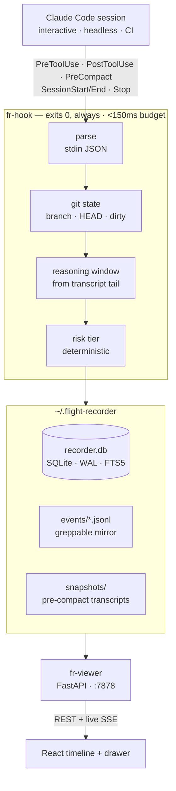

<div align="center">

<a name="top"></a>

# ✈️ Flight Recorder

### A local, real-time black box for your coding agent — what it did, and *why*

[](https://www.python.org/)
[](https://fastapi.tiangolo.com/)
[](https://react.dev/)
[](https://www.typescriptlang.org/)
[](https://tailwindcss.com/)

[](#development)
[](https://github.com/Anirudh-Kavle/Coding-agent-audit-trails/commits)
[](https://github.com/Anirudh-Kavle/Coding-agent-audit-trails/stargazers)
[](#privacy)
[](#license)


**[Install](#install)** • **[Usage](#usage)** • **[How it works](#how-it-works)** • **[Risk tiers](#risk-tiers)** • **[The viewer](#the-viewer)** • **[Development](#development)** • **[Roadmap](#roadmap)**

</div>

---

> Your agent's **actions** survive in git and shell history. Its **reasoning**
> does not — the transcript that held the "why" is compacted mid-session and
> auto-deleted after 30 days. Flight Recorder is the black box that keeps it.

**Flight Recorder** captures every consequential action your Claude Code agent
takes — shell commands, file edits, network calls, credential and account
operations — *at the moment it happens*, binds each action to the reasoning
that produced it, and preserves everything in a local, append-only, greppable
store with a live timeline. It pulls the reasoning out at hook time, before
compaction or deletion can destroy it. **The one-sentence demo:** ask *"why did
the agent add this environment variable?"* three weeks later, click the action,
and read the exact reasoning that produced it.

## Why

Ask yourself:

- Has an agent ever changed a config or created a resource you couldn't later explain?
- Do you run agents headless, in CI, or on cron — where nobody is watching?
- Have you lost the reasoning behind a change because the transcript compacted or expired?
- Do you need an audit trail of what an agent did — not just the chat log — for review or compliance?

**If yes to any of these, Flight Recorder is for you.** Agent actions have real
side effects, and the actions are often recoverable — but the *reasoning* lives
only in the transcript, which vanishes under context pressure and after 30
days. Everyone else records *what happened*; Flight Recorder durably records
*why*, and "why" is exactly what transcript deletion destroys.

> [!NOTE]
> **Best for:** developers running Claude Code locally, in CI, or on long
> headless jobs who want a durable, private record of what the agent did and
> why.
>
> **Not for:** cloud observability, blocking/policy enforcement (it records, it
> doesn't gate), or non–Claude Code agents (the event schema is agent-agnostic,
> but only the Claude Code hook adapter ships today).

## How Flight Recorder compares

| Tool | What it is | Why Flight Recorder is different |
|------|------------|----------------------------------|
| Post-hoc transcript summarizers | Distill an expired chat log into markdown | We capture at **action time** via hooks — nothing to lose to expiry |
| Cloud agent observability | Enterprise dashboards, OTel pipelines | **Local-first, zero-config** — your audit trail never leaves your disk |
| LLM call recorders | Record/replay calls for framework agents (LangChain, etc.) | We target **Claude Code natively** via hooks — no code changes |
| DIY hook loggers | Append tool names to a file | We capture **what + why + git state + risk**, with a live viewer |

<div align="right"><kbd><a href="#top">↑ back to top ↑</a></kbd></div>

## Install

**1 — the recorder + CLI** (Python 3.11+):

```
pip install -e .
```

**2 — build the viewer** (Node 18+):

```
cd viewer
npm install
npm run build
```

That produces `viewer/dist`, which `fr ui` serves. (For UI development, use
`npm run dev` instead — it runs on `:5173` and proxies `/api` to the backend.)

## Usage

```
cd your-project
fr init      # registers hooks in ./.claude/settings.json, creates the store
fr status    # hooks installed? events flowing? last event age
fr ui        # opens the live timeline at http://127.0.0.1:7878
fr grep rm   # grep across the plaintext JSONL mirror
```

Then just use Claude Code in that project. Actions stream into the timeline
live. `fr init --global` registers the hooks in `~/.claude/settings.json`
instead, so every project is recorded.

<div align="right"><kbd><a href="#top">↑ back to top ↑</a></kbd></div>

## How it works

A single hook runs on every Claude Code lifecycle event, writes directly to
SQLite in WAL mode, and **exits 0 no matter what** — a recorder that can break
the pilot's controls is worse than no recorder. **There is no daemon:** the
hook is the only writer, the viewer is a pure reader, so "forgot to start the
service" can't cause silent data loss, and install is one command.



The reasoning window is read from the tail of the live transcript at hook time.
When the model didn't narrate a step, the event is stored with an honest
`capture_gap` flag rather than fabricated text — **we never invent a "why."**
The `PreCompact` hook snapshots the whole transcript before Claude Code
compacts it, so the reasoning survives even when the context doesn't.

<div align="right"><kbd><a href="#top">↑ back to top ↑</a></kbd></div>

## Risk tiers

Every action is auto-tagged by a deterministic, table-driven classifier — no
LLM in the hot path. Rules live in one editable [`risk_rules.yaml`](flight_recorder/risk_rules.yaml).

| Tier | Colour | Triggers |
|------|--------|----------|
| `info` | ⚪ gray | `Read`, `Glob`, `Grep`, `LS` |
| `write` | 🔵 blue | `Edit`, `Write`, `NotebookEdit` |
| `exec` | 🟠 amber | `Bash` (default) |
| `network` | 🟣 purple | `WebFetch`, `WebSearch`, `curl`/`wget`/`ssh`/`scp` in a shell command |
| `sensitive` | 🔴 red | secrets/tokens, `rm -rf`, `sudo`, permissive `chmod`, `.env`, `DROP TABLE`, `git push --force`, account creation, keychain access |

Patterns are matched against a tool's **arguments and its result**, so a secret
that only appears in output still gets flagged. Search tools (`Grep`/`Glob`/
`WebSearch`) are exempt from argument matching — searching *for* the word
`sudo` isn't running it.

<div align="right"><kbd><a href="#top">↑ back to top ↑</a></kbd></div>

## The viewer

<div align="center">

<br/><br/>

</div>

One vertical stream, newest at top, risk colour as the primary channel. Every
row's first line of reasoning shows inline (`↳ why: …`); click any action for
the full drawer — **WHAT** (syntax-highlighted arguments), **WHY** (the
captured reasoning, verbatim), **CONTEXT** (git branch, HEAD, dirty flag), and
**RESULT** (output, exit status). Search takes qualifier chips —
`tool:bash risk:sensitive file:deploy session:brainstorm` — over a SQLite FTS5
index. Keyboard-native: `j`/`k` to move, `Enter` to open, `/` to search.

<div align="right"><kbd><a href="#top">↑ back to top ↑</a></kbd></div>

## Project structure

```
flight_recorder/            # the recorder (Python, stdlib + sqlite3)
├── hook.py                 # the hook Claude Code invokes; exits 0 unconditionally
├── reasoning.py            # reasoning-window extraction + PreCompact snapshot shield
├── risk.py + risk_rules.yaml   # deterministic, table-driven risk tiering
├── gitstate.py             # best-effort git context, timeout-bounded
├── store.py                # SQLite (WAL) + JSONL mirror, no daemon
├── schema.sql              # events + sessions + FTS5
├── cli.py                  # fr init | status | ui | grep
└── viewer/app.py           # FastAPI: REST + live SSE, serves the SPA
bin/fr_hook_entry.py        # standalone hook entry registered in settings.json
viewer/src/                 # the timeline UI (React 19 · TS · Vite · Tailwind 4)
├── components/             # Timeline, DetailDrawer, EventRow, SessionSidebar, …
├── hooks/                  # useEventStream (SSE), useKeyboardNav
└── lib/                    # api, dataSource, search, format (+ tests)
test_*.py                   # 60 backend gate tests
```

## Store layout

Everything lives under `~/.flight-recorder/`, all local, all yours:

```
recorder.db                 # SQLite, WAL mode, FTS5 search index
events/YYYY-MM-DD.jsonl     # append-only plaintext mirror — cat / grep / jq it
snapshots/<session>/        # transcripts copied before compaction
debug/raw_payloads.jsonl    # every raw hook payload, for parser inspection
```

## Privacy

Zero remote servers, zero external auth, zero cloud tracking. The hook makes no
network calls, ever. The entire suite passes the airplane-mode test — your
audit trail never leaves your disk. This is a headline feature, not an
afterthought.

<div align="right"><kbd><a href="#top">↑ back to top ↑</a></kbd></div>

## Development

**Backend:**

```
pip install -e ".[dev]"
python -m pytest            # 60 gate tests, deterministic, < 1s
```

**Frontend:**

```
cd viewer
npm install
npm run dev                 # :5173, proxies /api to :7878
npm test                    # 42 tests (vitest)
npm run build               # produces viewer/dist, served by `fr ui`
```

To try changes end to end: `fr init` in any project, use Claude Code, and watch
`fr ui`. New contributions ship with tests in the same commit — see
[CLAUDE.md](CLAUDE.md) for the working standard.

## Known limitations (honest, not hidden)

- **`capture_gap` is expected, not a bug.** Models often reason once and then
  chain several tool calls with no narration between them — those actions are
  recorded with no "why" because there genuinely wasn't one to capture.
- **Bash file extraction is best-effort**, not a real shell parser. It covers
  the common verbs (`rm`/`mv`/`cp`/`touch`/`mkdir`) and redirects; globs,
  subshells, and `find -exec` are silently missed rather than guessed at.
- **Risk classification is heuristic** — text patterns can't perfectly tell
  intent from mention.
- **The viewer is served from source** (`viewer/dist`), not packaged into the
  Python wheel yet.
- **History loads up to 5000 events** — a hard cap, not paginated.

## Roadmap

- **Incident report export** — select a time range → one markdown report of
  what happened, in order, with reasoning excerpts.
- **Multi-session view** — all recorded sessions in one list, cross-session search.
- **File-diff snapshots** — before/after content for edits, beyond what
  `tool_input` provides.
- **Sensitive-action desktop notification** — a ping the moment a
  `sensitive`-tier action fires.
- **Packaged viewer** — ship `viewer/dist` inside the wheel so `pip install` is
  the only step.

<div align="right"><kbd><a href="#top">↑ back to top ↑</a></kbd></div>

## License

MIT — see [`LICENSE`](LICENSE).

---

<div align="center"><sub>Built with Claude Code — and the first session in the demo database is the session that built it.</sub></div>
